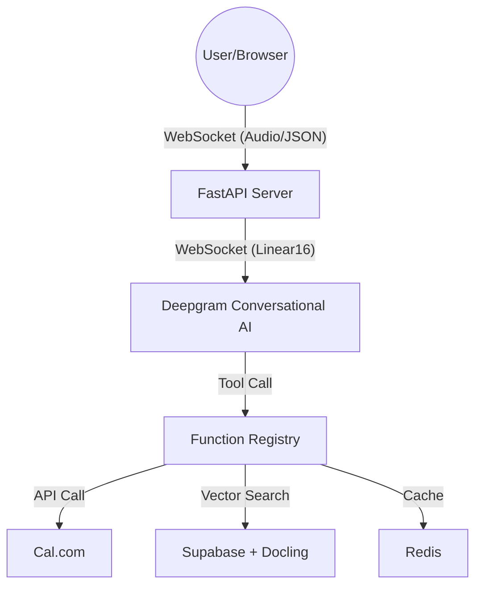

# Architecture

> Auto-generated by /map on 2026-03-23

## Overview
Zenisth is a multi-modal voice agent platform designed for high-performance, real-time AI conversations. It currently uses a FastAPI-based backend that relays browser-side mic input to a Speech-to-Speech (S2S) agent and handles complex business logic via tool/function calling.

## Components

### 1. API Server (`app/server.py`)
- **Purpose**: Acts as the central hub for the platform. It serves the frontend, handles file uploads/ingestion, and provides a persistent WebSocket relay for audio streaming.
- **Location**: `app/server.py`
- **Key Responsibilities**:
    - WebSocket management (`/ws`).
    - Document ingestion orchestration.
    - Configuration management.

### 2. Conversational Agent (`app/agent/`)
- **Settings (`settings.py`)**: Builds configuration for the S2S model (voice, stt, temperature).
- **Functions (`functions.py`)**: A centralized registry of tools available to the agent.
- **Tools**:
    - `book_appointment`: Integrated with Cal.com.
    - `check_availability`: Real-time slot checking via Cal.com.
    - `search_company_knowledge`: RAG retrieval.
    - `mark_dnc` & `transfer_to_human`: Call flow management.

### 3. Services Layer (`app/services/`)
- **Ingestion (`ingestion.py`)**: Uses `docling` to parse PDF/Docx/Txt into Markdown nodes.
- **Retrieval (`retrieval.py`)**: Handles Supabase vector queries for RAG.
- **Storage (`storage.py`)**: Manages Supabase insertions and Redis caching.
- **Calendar (`calendar.py`)**: Real-time integration with Cal.com V2 API.

### 4. Frontend Engine
- **Files**: `index.html`, `script.js`, `style.css`, `audio-worklet.js`.
- **Logic**: Handles mic capturing, AudioWorklet-based audio processing, and visual feedback (transcripts, event logs).

## Data Flow
1. **Connection**: Browser opens WebSocket → Sends `user_cfg`.
2. **Relay**: Server connects to Deepgram (current) or Gemini (planned) → Exchanges Audio/JSON.
3. **Intelligence**: Agent receives audio → Transcribes → Contextualizes → Decides on Function Call.
4. **Action**: `functions.py` dispatches tool → result goes back to Agent → Agent speaks response.
5. **Retrieval**: If knowledge is needed, RAG service queries Supabase vector store → provides context to the agent.

## Technical Debt & Observations
- [ ] **Migration State**: The codebase is currently using Deepgram Agent API, but the roadmap indicates a migration to Google Gemini Multimodal Live API.
- [ ] **Persistence**: Appointment and DNC logs in `functions.py` are currently in-memory.
- [ ] **Concurrency**: Using `nest_asyncio` to force async calls into sync handlers is a temporary pattern that should be refactored for native async S2S agents.
- [ ] **Vobiz Integration**: Outbound calling integration is requested but not yet fully implemented in the main server loop.
